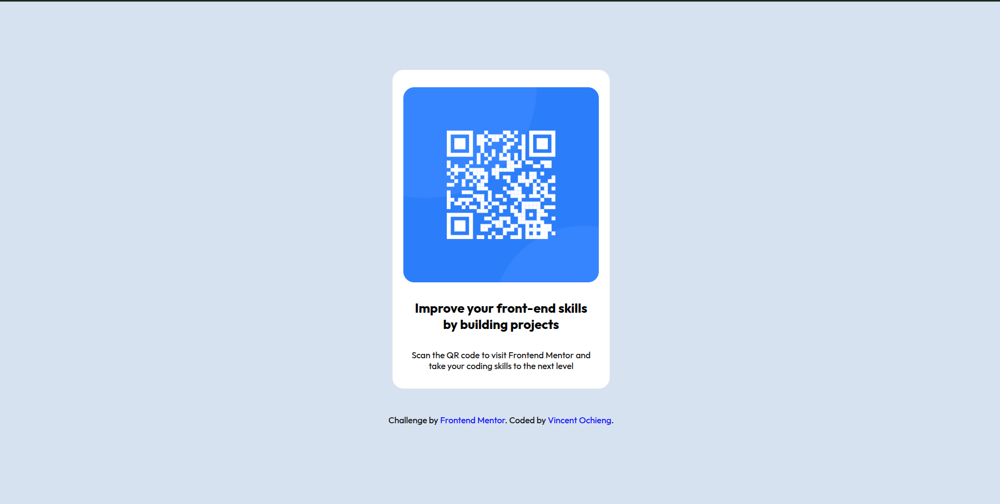

# Frontend Mentor - QR code component solution

This is a solution to the [QR code component challenge on Frontend Mentor](https://www.frontendmentor.io/challenges/qr-code-component-iux_sIO_H). Frontend Mentor challenges help you improve your coding skills by building realistic projects. 

## Table of contents

- [Overview](#overview)
  - [Screenshot](#screenshot)
  - [Links](#links)
- [My process](#my-process)
  - [Built with](#built-with)
  - [What I learned](#what-i-learned)
  - [Continued development](#continued-development)
  - [Useful resources](#useful-resources)
  - [AI Collaboration](#ai-collaboration)
- [Author](#author)
- [Acknowledgments](#acknowledgments)

**Note: Delete this note and update the table of contents based on what sections you keep.**

## Overview

### Screenshot

### Links

- Solution URL: [https://github.com/VIN9CENT/qr-code-card-challenge]
- Live Site URL: [https://qr-code-card-challenge-eight.vercel.app/]

## My process

### Built with

- Semantic HTML5 markup
- Vanilla CSS
- Flexbox
- BEM CSS Methodology

### What I learned

I learnd how I can use the max-width property to ensure the image is responsive. 

### Continued development

I want to continue focussing on designing responsive websites. I would also like to explore other display options like grid

### Useful resources

- [resource 1](https://www.example.com) - This helped me to learn and implement BEM Methodology. I really liked this methodology and will use it going forward.

### AI Collaboration

I avoided using AI for this project as I was looking to solidify the fundamentals.
## Author

- Website - [Vincent Ochieng](https://qr-code-card-challenge-eight.vercel.app/)
- Frontend Mentor - [@vin9cent](https://www.frontendmentor.io/profile/vin9cent)

## Acknowledgments

N/A
